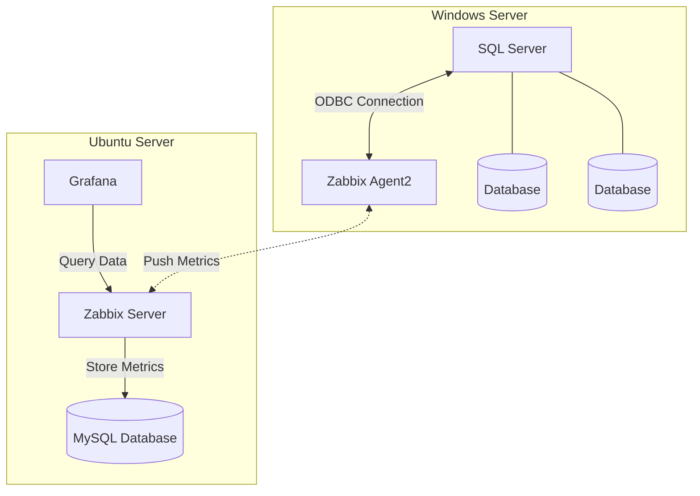

# 📊 SQL Server Monitoring Solution

Complete monitoring solution for SQL Server and databases, using Zabbix and Grafana tools for real-time visualization of metrics and alerts.


## 📋 Table of Contents

- [Overview](#overview)
- [Architecture](#architecture)
- [Prerequisites](#prerequisites)
- [Installation and Configuration](#installation-and-configuration)
- [Monitored Metrics](#monitored-metrics)
- [Dashboards](#dashboards)
- [Troubleshooting](#troubleshooting)
- [Contribution](#contribution)
- [License](#license)

## 🎯 Overview

This project implements a robust monitoring solution for SQL Server instances, enabling:

- Real-time performance and availability monitoring
- Automatic alerts for critical events
- Intuitive visual dashboards in Grafana
- Historical metrics for trend analysis
- Monitoring of multiple databases on the same instance
- Integration between Zabbix and Grafana for advanced visualization

## 🏗️ Architecture


The solution consists of two main servers:

### Ubuntu Server - Monitoring Server

**Ubuntu Server Components:**

- **Zabbix Server**: Centralized monitoring system
- **MySQL**: Database for storing collected metrics
- **Grafana**: Dashboard and real-time graph visualization
- **mssql-zabbix**: Templates and scripts for SQL Server integration with Zabbix


### Windows Server - SQL Server

**Windows Server Components:**

- **SQL Server**: Microsoft SQL Server database instance
- **Databases**: Databases to be monitored
- **Zabbix Agent**: Agent responsible for collecting SQL Server metrics

## 📦 Prerequisites

### Ubuntu Server (Monitoring)
- Ubuntu Server 20.04 or higher
- Minimum 4GB RAM (8GB recommended)
- 50GB disk space
- Root or sudo access
- Internet connection for package downloads

### Windows Server (SQL Server)
- Windows Server 2016 or higher
- SQL Server 2016 or higher
- Minimum 4GB RAM (depends on SQL workload)
- Administrative access
- Network connectivity with Ubuntu Server

## 🚀 Installation and Configuration

### 1️⃣ Ubuntu Server - Zabbix Installation

#### Zabbix Server + MySQL Installation

```bash
# Update system
sudo apt update && sudo apt upgrade -y

# Install MySQL Server
sudo apt install -y mysql-server

# Configure database for Zabbix
sudo mysql -u root -p
```

```sql
CREATE DATABASE zabbix CHARACTER SET utf8mb4 COLLATE utf8mb4_bin;
CREATE USER 'zabbix'@'localhost' IDENTIFIED BY 'your_secure_password';
GRANT ALL PRIVILEGES ON zabbix.* TO 'zabbix'@'localhost';
FLUSH PRIVILEGES;
EXIT;
```

```bash
# Add Zabbix repository
wget https://repo.zabbix.com/zabbix/6.4/ubuntu/pool/main/z/zabbix-release/zabbix-release_6.4-1+ubuntu22.04_all.deb
sudo dpkg -i zabbix-release_6.4-1+ubuntu22.04_all.deb
sudo apt update

# Install Zabbix Server, Frontend, and Agent
sudo apt install -y zabbix-server-mysql zabbix-frontend-php zabbix-apache-conf zabbix-sql-scripts zabbix-agent

# Import database schema
zcat /usr/share/zabbix-sql-scripts/mysql/server.sql.gz | mysql --default-character-set=utf8mb4 -uzabbix -p zabbix

# Configure Zabbix Server
sudo nano /etc/zabbix/zabbix_server.conf
```

Edit the following lines in the configuration file:
```ini
DBPassword=your_secure_password
```

```bash
# Start services
sudo systemctl restart zabbix-server zabbix-agent apache2
sudo systemctl enable zabbix-server zabbix-agent apache2

# Adjust PHP timezone
sudo nano /etc/zabbix/apache.conf
# Uncomment and adjust: date.timezone = America/Sao_Paulo
sudo systemctl restart apache2
```

Access Zabbix Frontend: `http://your-ubuntu-ip/zabbix`

### 2️⃣ Grafana Installation

```bash
# Add Grafana repository
sudo wget -q -O - https://packages.grafana.com/gpg.key | sudo apt-key add -
echo "deb https://packages.grafana.com/oss/deb stable main" | sudo tee /etc/apt/sources.list.d/grafana.list

# Install Grafana
sudo apt update
sudo apt install -y grafana

# Start Grafana
sudo systemctl start grafana-server
sudo systemctl enable grafana-server
```

Access Grafana: `http://your-ubuntu-ip:3000` (username/password: admin/admin)

#### Zabbix and Grafana Integration

1. Install Zabbix plugin in Grafana:
```bash
sudo grafana-cli plugins install alexanderzobnin-zabbix-app
sudo systemctl restart grafana-server
```

2. Enable the plugin in Grafana: Settings → Plugins → Zabbix → Enable

3. Configure Zabbix datasource: Configuration → Data Sources → Add data source → Zabbix

### 3️⃣ mssql-zabbix Configuration

```bash
# Clone mssql-zabbix repository
cd /opt
sudo git clone https://github.com/dbafromthecold/mssql-zabbix.git
cd mssql-zabbix

# Copy Zabbix Agent scripts
sudo cp scripts/* /etc/zabbix/scripts/
sudo chmod +x /etc/zabbix/scripts/*.ps1

# Import templates in Zabbix
# Access: Configuration → Templates → Import
# Select the .xml files from the repository
```

### 4️⃣ Windows Server - Zabbix Agent Configuration

#### Zabbix Agent Installation

```powershell
# Download Zabbix Agent
Invoke-WebRequest -Uri "https://cdn.zabbix.com/zabbix/binaries/stable/6.4/6.4.0/zabbix_agent-6.4.0-windows-amd64-openssl.msi" -OutFile "zabbix_agent.msi"

# Install
msiexec /i zabbix_agent.msi SERVER="UBUNTU_IP" SERVERACTIVE="UBUNTU_IP" HOSTNAME="SQL-Server" /qn

# Configure Firewall permissions
New-NetFirewallRule -DisplayName "Zabbix Agent" -Direction Inbound -Protocol TCP -LocalPort 10050 -Action Allow

# Start service
Start-Service ZabbixAgent
Set-Service ZabbixAgent -StartupType Automatic
```

#### SQL Server Monitoring Configuration

On the Windows Server, ensure that:

1. **SQL Server Permissions** - Create a user with read permissions:
```sql
USE master;
CREATE LOGIN zabbix_monitor WITH PASSWORD = 'secure_password';
GRANT VIEW SERVER STATE TO zabbix_monitor;
GRANT SELECT ON sys.databases TO zabbix_monitor;
```

2. **Agent Configuration** - Edit `C:\Program Files\Zabbix Agent\zabbix_agentd.conf`:
```ini
Server=UBUNTU_IP
ServerActive=UBUNTU_IP
Hostname=SQL-Server
```

3. **Restart Agent**:
```powershell
Restart-Service ZabbixAgent
```

#### Add Host in Zabbix

1. Access Zabbix Frontend
2. Configuration → Hosts → Create host
3. Fill in:
   - **Host name**: SQL-Server
   - **Groups**: Linux servers (or create Windows Servers group)
   - **Agent interfaces**: Windows Server IP, Port 10050
4. In the **Templates** tab, add mssql-zabbix templates:
   - MSSQL by Zabbix Agent
   - MSSQL Database by Zabbix Agent
5. Click **Add**

## 📈 Monitored Metrics

The solution monitors the following metric categories:

### 🖥️ SQL Server Instance

- **SQL Server Uptime**
- **SQL Server Version and Edition**
- **Active Connections**
- **Transactions per Second**
- **Batch Requests per Second**
- **SQL Compilations per Second**
- **SQL Recompilations per Second**
- **Page Life Expectancy**
- **Buffer Cache Hit Ratio**
- **Memory Usage**

### 💾 Databases

- **Database Status**
- **Database Size (Data + Log)**
- **Disk Space Usage**
- **Transactions per Second**
- **Active Queries**
- **Deadlocks**
- **Locks**
- **Query Response Time**
- **Backup Status**
- **Last Backup Data/Log**

### 📊 Performance

- **CPU Usage**
- **Memory Usage**
- **Disk I/O**
- **Network Latency**
- **Wait Stats**
- **Latches and Spinlocks**

### 🚨 Configured Alerts

- **High CPU utilization** (> 80%)
- **Low Page Life Expectancy** (< 300 seconds)
- **Database offline or suspect**
- **Backup failure**
- **Frequent deadlocks**
- **Slow queries**
- **Low disk space** (< 10%)

## 📊 Dashboards

### Zabbix Dashboard

Zabbix provides native dashboards with:
- Real-time monitoring
- Historical graphs
- Network maps
- Alert status
- Latest problems

Access: `http://your-ubuntu-ip/zabbix/zabbix.php?action=dashboard.view`

### Grafana Dashboard

Custom dashboards with advanced visualization:

**Main Panels:**

1. **SQL Server Overview**
   - Overall instance status
   - CPU, Memory, Disk metrics
   - Active connections
   - Transactions per second

2. **Database Performance**
   - Database sizes
   - Performance per database
   - Slow queries
   - Deadlocks and blocks

3. **Resource Utilization**
   - CPU history
   - Memory usage
   - Disk I/O
   - Network latency

4. **Alerts & Events**
   - Alert list
   - Event history
   - Severity by period
   - Response time

**How to Import Dashboards in Grafana:**

1. Access `http://your-ubuntu-ip:3000`
2. Dashboards → Import
3. Load dashboard JSON files or use the ID from Grafana.com
4. Configure Zabbix datasource
5. Click Import

## 🔧 Troubleshooting

### Common Problems

#### Zabbix Agent Cannot Connect to Server

```bash
# Check status on Windows
Get-Service ZabbixAgent

# Check logs
Get-Content "C:\Program Files\Zabbix Agent\zabbix_agentd.log"

# Test connectivity
Test-NetConnection UBUNTU_IP -Port 10050

# Check Windows firewall
Get-NetFirewallRule -DisplayName "Zabbix Agent*"
```

#### Metrics Not Being Collected from SQL Server

```powershell
# Check SQL permissions
# Connect to SQL Server and run:
SELECT HAS_PERMS_BY_NAME(NULL, NULL, 'VIEW SERVER STATE');
-- Should return 1

# Test manual query
sqlcmd -S localhost -U zabbix_monitor -P secure_password -Q "SELECT @@VERSION"
```

#### Grafana Cannot Connect to Zabbix

```bash
# Check Zabbix API
curl -s -X POST http://localhost/zabbix/api_jsonrpc.php \
-H 'Content-Type: application/json' \
-d '{"jsonrpc":"2.0","method":"apiinfo.version","auth":null,"id":1}'

# Check Grafana logs
sudo journalctl -u grafana-server -f
```

#### High Resource Consumption on Zabbix Server

```bash
# Adjust Zabbix Server configuration
sudo nano /etc/zabbix/zabbix_server.conf

# Important parameters:
StartPollers=10
StartPingers=10
StartTrappers=10
StartDiscoverers=10
CacheSize=256M
HistoryCacheSize=64M
HistoryIndexCacheSize=16M
Timeout=30

# Restart service
sudo systemctl restart zabbix-server
```

### Useful Commands

**Ubuntu Server:**
```bash
# Check Zabbix status
sudo systemctl status zabbix-server zabbix-agent

# Check logs
sudo tail -f /var/log/zabbix/zabbix_server.log
sudo tail -f /var/log/zabbix/zabbix_agentd.log

# Restart services
sudo systemctl restart zabbix-server zabbix-agent apache2 grafana-server

# Check MySQL database
sudo mysql -u zabbix -p zabbix
```

**Windows Server:**
```powershell
# Check agent status
Get-Service ZabbixAgent

# Check logs
Get-Content "C:\Program Files\Zabbix Agent\zabbix_agentd.log" -Tail 50

# Restart agent
Restart-Service ZabbixAgent

# Check connection to SQL Server
sqlcmd -L
sqlcmd -S localhost -Q "SELECT @@VERSION"
```

## 🛠️ Advanced Configuration

### Email Notifications

In Zabbix:
1. Administration → Media types → Email → Configure
2. Set SMTP server, port, and sending email
3. Configure recipient: Administration → Users → Media → Add

### Telegram/Slack Notifications

Use Zabbix webhooks or custom scripts in `/etc/zabbix/alertscripts/`.

### Data Retention

Configure automatic cleanup in Zabbix:
1. Administration → General → Housekeeping
2. Adjust retention period for:
   - History: 14-30 days
   - Trends: 365 days

### High Availability

For production environments, consider:
- Zabbix Proxy for remote environments
- MySQL or PostgreSQL Cluster
- Load balancer for multiple Grafana instances

## 📚 Additional Resources

- [Official Zabbix Documentation](https://www.zabbix.com/documentation)
- [Official Grafana Documentation](https://grafana.com/docs/)
- [Zabbix Community](https://www.zabbix.com/forum/)

## 🙏 Acknowledgments

- Zabbix team for the excellent monitoring tool
- Grafana team for the incredible dashboards
- Open-source community for templates and scripts

---
