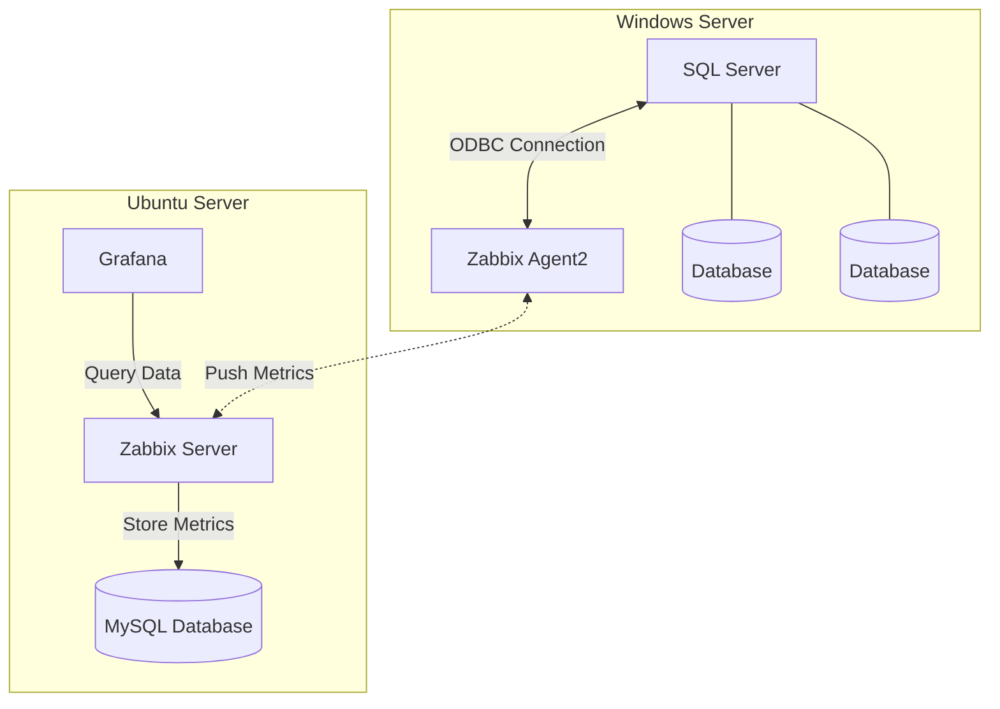

# 📊 SQL Server Monitoring Solution

Solução completa de monitoramento para SQL Server e bancos de dados, utilizando as ferramentas Zabbix e Grafana para visualização em tempo real de métricas e alertas.


## 📋 Índice

- [Visão Geral](#visão-geral)
- [Arquitetura](#arquitetura)
- [Pré-requisitos](#pré-requisitos)
- [Instalação e Configuração](#instalação-e-configuração)
- [Métricas Monitoradas](#métricas-monitoradas)
- [Dashboards](#dashboards)
- [Troubleshooting](#troubleshooting)
- [Contribuição](#contribuição)
- [Licença](#licença)

## 🎯 Visão Geral

Este projeto implementa uma solução robusta de monitoramento para instâncias SQL Server, permitindo:

- Monitoramento em tempo real de performance e disponibilidade
- Alertas automáticos para eventos críticos
- Dashboards visuais intuitivos no Grafana
- Histórico de métricas para análise de tendências
- Monitoramento de múltiplos bancos de dados em uma mesma instância
- Integração entre Zabbix e Grafana para visualização avançada

## 🏗️ Arquitetura


A solução é composta por dois servidores principais:

### Ubuntu Server - Servidor de Monitoramento

**Componentes do Ubuntu Server:**

- **Zabbix Server**: Sistema de monitoramento centralizado
- **MySQL**: Banco de dados para armazenamento de métricas coletadas
- **Grafana**: Visualização de dashboards e gráficos em tempo real
- **mssql-zabbix**: Templates e scripts para integração SQL Server com Zabbix


### Windows Server - SQL Server

**Componentes do Windows Server:**

- **SQL Server**: Instância do banco de dados Microsoft SQL Server
- **Bancos de Dados**: Base de dados a serem monitoradas
- **Zabbix Agent**: Agente responsável pela coleta de métricas do SQL Server

## 📦 Pré-requisitos

### Ubuntu Server (Monitoramento)
- Ubuntu Server 20.04 ou superior
- Mínimo de 4GB RAM (8GB recomendado)
- 50GB de espaço em disco
- Acesso de root ou sudo
- Conexão com internet para download de pacotes

### Windows Server (SQL Server)
- Windows Server 2016 ou superior
- SQL Server 2016 ou superior
- 4GB RAM mínimos (depende da carga de trabalho SQL)
- Acesso administrativo
- Conectividade de rede com o Ubuntu Server

## 🚀 Instalação e Configuração

### 1️⃣ Ubuntu Server - Instalação do Zabbix

#### Instalação do Zabbix Server + MySQL

```bash
# Atualizar sistema
sudo apt update && sudo apt upgrade -y

# Instalar MySQL Server
sudo apt install -y mysql-server

# Configurar banco de dados para Zabbix
sudo mysql -u root -p
```

```sql
CREATE DATABASE zabbix CHARACTER SET utf8mb4 COLLATE utf8mb4_bin;
CREATE USER 'zabbix'@'localhost' IDENTIFIED BY 'sua_senha_segura';
GRANT ALL PRIVILEGES ON zabbix.* TO 'zabbix'@'localhost';
FLUSH PRIVILEGES;
EXIT;
```

```bash
# Adicionar repositório Zabbix
wget https://repo.zabbix.com/zabbix/6.4/ubuntu/pool/main/z/zabbix-release/zabbix-release_6.4-1+ubuntu22.04_all.deb
sudo dpkg -i zabbix-release_6.4-1+ubuntu22.04_all.deb
sudo apt update

# Instalar Zabbix Server, Frontend e Agent
sudo apt install -y zabbix-server-mysql zabbix-frontend-php zabbix-apache-conf zabbix-sql-scripts zabbix-agent

# Importar esquema do banco de dados
zcat /usr/share/zabbix-sql-scripts/mysql/server.sql.gz | mysql --default-character-set=utf8mb4 -uzabbix -p zabbix

# Configurar Zabbix Server
sudo nano /etc/zabbix/zabbix_server.conf
```

Editar as seguintes linhas no arquivo de configuração:
```ini
DBPassword=sua_senha_segura
```

```bash
# Iniciar serviços
sudo systemctl restart zabbix-server zabbix-agent apache2
sudo systemctl enable zabbix-server zabbix-agent apache2

# Ajustar timezone PHP
sudo nano /etc/zabbix/apache.conf
# Descomentar e ajustar: date.timezone = America/Sao_Paulo
sudo systemctl restart apache2
```

Acesse o Zabbix Frontend: `http://seu-ip-ubuntu/zabbix`

### 2️⃣ Instalação do Grafana

```bash
# Adicionar repositório Grafana
sudo wget -q -O - https://packages.grafana.com/gpg.key | sudo apt-key add -
echo "deb https://packages.grafana.com/oss/deb stable main" | sudo tee /etc/apt/sources.list.d/grafana.list

# Instalar Grafana
sudo apt update
sudo apt install -y grafana

# Iniciar Grafana
sudo systemctl start grafana-server
sudo systemctl enable grafana-server
```

Acesse o Grafana: `http://seu-ip-ubuntu:3000` (usuário/senha: admin/admin)

#### Integração Zabbix com Grafana

1. Instalar plugin Zabbix no Grafana:
```bash
sudo grafana-cli plugins install alexanderzobnin-zabbix-app
sudo systemctl restart grafana-server
```

2. Ativar o plugin no Grafana: Settings → Plugins → Zabbix → Enable

3. Configurar datasource Zabbix: Configuration → Data Sources → Add data source → Zabbix

### 3️⃣ Configuração do mssql-zabbix

```bash
# Clonar repositório mssql-zabbix
cd /opt
sudo git clone https://github.com/dbafromthecold/mssql-zabbix.git
cd mssql-zabbix

# Copiar scripts do Zabbix Agent
sudo cp scripts/* /etc/zabbix/scripts/
sudo chmod +x /etc/zabbix/scripts/*.ps1

# Importar templates no Zabbix
# Acesse: Configuration → Templates → Import
# Selecione os arquivos .xml do repositório
```

### 4️⃣ Windows Server - Configuração do Zabbix Agent

#### Instalação do Zabbix Agent

```powershell
# Baixar Zabbix Agent
Invoke-WebRequest -Uri "https://cdn.zabbix.com/zabbix/binaries/stable/6.4/6.4.0/zabbix_agent-6.4.0-windows-amd64-openssl.msi" -OutFile "zabbix_agent.msi"

# Instalar
msiexec /i zabbix_agent.msi SERVER="IP_DO_UBUNTU" SERVERACTIVE="IP_DO_UBUNTU" HOSTNAME="SQL-Server" /qn

# Configurar permissões do Firewall
New-NetFirewallRule -DisplayName "Zabbix Agent" -Direction Inbound -Protocol TCP -LocalPort 10050 -Action Allow

# Iniciar serviço
Start-Service ZabbixAgent
Set-Service ZabbixAgent -StartupType Automatic
```

#### Configuração de Monitoramento SQL Server

No Windows Server, certifique-se de que:

1. **Permissões SQL Server** - Crie um usuário com permissões de leitura:
```sql
USE master;
CREATE LOGIN zabbix_monitor WITH PASSWORD = 'senha_segura';
GRANT VIEW SERVER STATE TO zabbix_monitor;
GRANT SELECT ON sys.databases TO zabbix_monitor;
```

2. **Configuração do Agent** - Edite `C:\Program Files\Zabbix Agent\zabbix_agentd.conf`:
```ini
Server=IP_DO_UBUNTU
ServerActive=IP_DO_UBUNTU
Hostname=SQL-Server
```

3. **Reiniciar Agente**:
```powershell
Restart-Service ZabbixAgent
```

#### Adicionar Host no Zabbix

1. Acesse o Zabbix Frontend
2. Configuration → Hosts → Create host
3. Preencha:
   - **Host name**: SQL-Server
   - **Groups**: Linux servers (ou crie grupo Windows Servers)
   - **Agent interfaces**: IP do Windows Server, Port 10050
4. Na aba **Templates**, adicione os templates do mssql-zabbix:
   - MSSQL by Zabbix Agent
   - MSSQL Database by Zabbix Agent
5. Clique em **Add**

## 📈 Métricas Monitoradas

A solução monitora as seguintes categorias de métricas:

### 🖥️ SQL Server Instance

- **Uptime do SQL Server**
- **Versão e Edition do SQL Server**
- **Conexões Ativas**
- **Transações por Segundo**
- **Batch Requests por Segundo**
- **Compilações SQL por Segundo**
- **Recompilações SQL por Segundo**
- **Page Life Expectancy**
- **Buffer Cache Hit Ratio**
- **Memory Usage**

### 💾 Databases

- **Status do Banco de Dados**
- **Tamanho do Banco (Data + Log)**
- **Uso de Espaço em Disco**
- **Transações por Segundo**
- **Queries Ativas**
- **Deadlocks**
- **Bloqueios (Locks)**
- **Tempo de Resposta de Queries**
- **Backup Status**
- **Último Backup Data/Log**

### 📊 Performance

- **CPU Usage**
- **Memory Usage**
- **Disk I/O**
- **Network Latency**
- **Wait Stats**
- **Latches e Spinlocks**

### 🚨 Alertas Configurados

- **Alta utilização de CPU** (> 80%)
- **Baixo Page Life Expectancy** (< 300 segundos)
- **Banco de dados offline ou suspect**
- **Falha em backup**
- **Deadlocks frequentes**
- **Lentidão em queries**
- **Disk space baixo** (< 10%)

## 📊 Dashboards

### Zabbix Dashboard

O Zabbix fornece dashboards nativos com:
- Monitoramento em tempo real
- Gráficos de histórico
- Mapas de rede
- Status de alertas
- Últimos problemas

Acesse: `http://seu-ip-ubuntu/zabbix/zabbix.php?action=dashboard.view`

### Grafana Dashboard

Dashboards customizados com visualização avançada:

**Painéis Principais:**

1. **SQL Server Overview**
   - Status geral da instância
   - Métricas de CPU, Memória, Disco
   - Conexões ativas
   - Transações por segundo

2. **Database Performance**
   - Tamanho dos bancos de dados
   - Performance por banco
   - Queries lentas
   - Deadlocks e bloqueios

3. **Resource Utilization**
   - Histórico de CPU
   - Uso de memória
   - I/O de disco
   - Latência de rede

4. **Alerts & Events**
   - Lista de alertas
   - Histórico de eventos
   - Severidade por período
   - Tempo de resposta

**Como Importar Dashboards no Grafana:**

1. Acesse `http://seu-ip-ubuntu:3000`
2. Dashboards → Import
3. Carregue os arquivos JSON dos dashboards ou use o ID do Grafana.com
4. Configure o datasource Zabbix
5. Clique em Import

## 🔧 Troubleshooting

### Problemas Comuns

#### Zabbix Agent não conecta ao Server

```bash
# Verificar status no Windows
Get-Service ZabbixAgent

# Verificar logs
Get-Content "C:\Program Files\Zabbix Agent\zabbix_agentd.log"

# Testar conectividade
Test-NetConnection IP_DO_UBUNTU -Port 10050

# Verificar firewall Windows
Get-NetFirewallRule -DisplayName "Zabbix Agent*"
```

#### Métricas não sendo coletadas do SQL Server

```powershell
# Verificar permissões SQL
# Conecte no SQL Server e execute:
SELECT HAS_PERMS_BY_NAME(NULL, NULL, 'VIEW SERVER STATE');
-- Deve retornar 1

# Testar consulta manualmente
sqlcmd -S localhost -U zabbix_monitor -P senha_segura -Q "SELECT @@VERSION"
```

#### Grafana não conecta ao Zabbix

```bash
# Verificar API do Zabbix
curl -s -X POST http://localhost/zabbix/api_jsonrpc.php \
-H 'Content-Type: application/json' \
-d '{"jsonrpc":"2.0","method":"apiinfo.version","auth":null,"id":1}'

# Verificar logs do Grafana
sudo journalctl -u grafana-server -f
```

#### Alto consumo de recursos no Zabbix Server

```bash
# Ajustar configuração do Zabbix Server
sudo nano /etc/zabbix/zabbix_server.conf

# Parâmetros importantes:
StartPollers=10
StartPingers=10
StartTrappers=10
StartDiscoverers=10
CacheSize=256M
HistoryCacheSize=64M
HistoryIndexCacheSize=16M
Timeout=30

# Reiniciar serviço
sudo systemctl restart zabbix-server
```

### Comandos Úteis

**Ubuntu Server:**
```bash
# Verificar status Zabbix
sudo systemctl status zabbix-server zabbix-agent

# Verificar logs
sudo tail -f /var/log/zabbix/zabbix_server.log
sudo tail -f /var/log/zabbix/zabbix_agentd.log

# Reiniciar serviços
sudo systemctl restart zabbix-server zabbix-agent apache2 grafana-server

# Verificar banco de dados MySQL
sudo mysql -u zabbix -p zabbix
```

**Windows Server:**
```powershell
# Verificar status do agent
Get-Service ZabbixAgent

# Verificar logs
Get-Content "C:\Program Files\Zabbix Agent\zabbix_agentd.log" -Tail 50

# Reiniciar agente
Restart-Service ZabbixAgent

# Verificar conexão com SQL Server
sqlcmd -L
sqlcmd -S localhost -Q "SELECT @@VERSION"
```

## 🛠️ Configuração Avançada

### Notificações por Email

No Zabbix:
1. Administration → Media types → Email → Configure
2. Defina servidor SMTP, porta, e-mail de envio
3. Configure recipient: Administration → Users → Media → Add

### Notificações por Telegram/Slack

Use os webhooks do Zabbix ou scripts personalizados em `/etc/zabbix/alertscripts/`.

### Retenção de Dados

Configure a limpeza automática no Zabbix:
1. Administration → General → Housekeeping
2. Ajuste o período de retenção para:
   - History: 14-30 dias
   - Trends: 365 dias

### Alta Disponibilidade

Para ambientes de produção, considere:
- Zabbix Proxy para ambientes remotos
- Cluster MySQL ou PostgreSQL
- Load balancer para múltiplos Grafana

## 📚 Recursos Adicionais

- [Documentação Oficial Zabbix](https://www.zabbix.com/documentation)
- [Documentação Oficial Grafana](https://grafana.com/docs/)
- [Zabbix Community](https://www.zabbix.com/forum/)

## 🙏 Agradecimentos

- Equipe Zabbix pela excelente ferramenta de monitoramento
- Equipe Grafana pelos dashboards incríveis
- Comunidade open-source por templates e scripts

---


